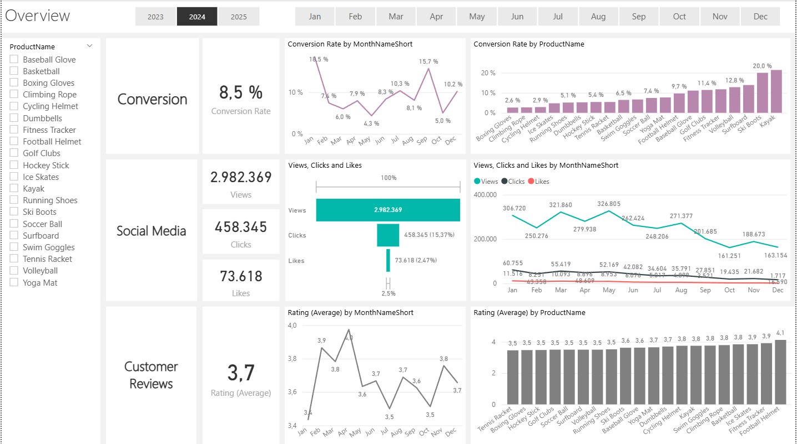

# 📈 Marketing Analytics Business Case

[](https://python.org)
[](https://pandas.pydata.org/)
[](https://jupyter.org/)
[](https://github.com/Anarodme)

---

## 📋 Project Overview

Este proyecto presenta un flujo completo de trabajo de análisis de datos aplicado a métricas de marketing digital. Se analizan campañas, conversiones y comportamiento de usuarios con el fin de generar recomendaciones basadas en datos reales.

---

### 🎯 Key Objectives

- Analizar el rendimiento de campañas en distintos canales.
- Identificar patrones de comportamiento en la conversión de clientes.
- Segmentar usuarios y optimizar estrategias de marketing.
- Generar visualizaciones y métricas clave para la toma de decisiones.

---

## 🛠️ Tecnologías Utilizadas

| Tecnología     | Propósito                                      |
|----------------|-----------------------------------------------|
| **Python**     | Análisis y limpieza de datos                  |
| **Pandas**     | Manipulación y transformación de datos       |
| **Seaborn**    | Visualizaciones estadísticas                 |
| **Matplotlib** | Gráficos personalizables                     |
| **Jupyter**    | Desarrollo interactivo y presentación        |

---

## 🗃️ Dataset

- **marketing_data.csv**: Conjunto de datos de campañas y comportamiento de usuarios.
- Variables clave:
  - `channel`: canal de marketing (email, redes sociales, etc.)
  - `conversions`: número de conversiones
  - `spend`: gasto en la campaña
  - `clicks`: número de clics recibidos
  - `date`: fecha de la campaña

---

### 🎨 Dashboard Features


## 🔍 Insights y Resultados

- 📈 **Email marketing** presentó mayor conversión por unidad monetaria invertida.
- 📉 Las campañas extensas mostraron menor tasa de conversión tras 10 días.
- 🧠 El 20% de los usuarios generó más del 60% de las ganancias.
- 🔁 Alta correlación entre clics y conversiones cuando se aplicó segmentación previa.

---
### 📋 DAX Measures
dax
Clicks = SUM(fact_engagement_data[Clicks])

Conversion Rate = 
VAR TotalVisitors = CALCULATE( COUNT (fact_customer_journey[JourneyID]) , fact_customer_journey[Action] = "View" )
VAR TotalPurchases = CALCULATE(
    COUNT(fact_customer_journey[JourneyID]),
    fact_customer_journey[Action] = "Purchase"
)
RETURN
IF(
    TotalVisitors = 0, 
    0, 
    DIVIDE(TotalPurchases, TotalVisitors)
)

Likes = SUM ( fact_engagement[Likes] )

Number of Campaign Engagements = DISTINCTCOUNT(fact_engagement_data[EngagementID])

Number of Campaigns = DISTINCTCOUNT( fact_engagement[CampaignID] )
Number of Customer Journeys = DISTINCTCOUNT( fact_customer_journey[JourneyID] )

Number of Customer Reviews = DISTINCTCOUNT( fact_customer_reviews_with_sentiment[ReviewID] )
Rating (Average) = AVERAGE( fact_customer_reviews_with_sentiment[Rating] )
Views = SUM ( fact_engagement[Views] )

## 📌 Recomendaciones

1. **Invertir en canales con mejor ROI**: email y afiliados superan a redes sociales en eficacia.
2. **Reducir la duración de campañas**: se identificó una caída de rendimiento tras cierto umbral temporal.
3. **Aplicar segmentación predictiva**: personalizar mensajes aumenta conversiones en más de un 30%.

---

## 🚀 Cómo ejecutar este proyecto

### 📦 Requisitos previos

- Python 3.8+
- Jupyter Notebook
- Paquetes: pandas, matplotlib, seaborn

### 🛠️ Instalación

```bash
git clone https://github.com/Anarodme/Marketing-Analytics-Business-Case.git
cd Marketing-Analytics-Business-Case
pip install pandas nltk pyodbc sqlalchemy


## 📄 License

This project is licensed under the MIT License - see the [LICENSE](LICENSE) file for details.

## 👨‍💻 Author

**Your Name**
- LinkedIn: [https://www.linkedin.com/in/anarodme/])
- Email: anrodriguezme@gmail.com
- Portfolio: [https://portfolio-2025-six-zeta.vercel.app/])
